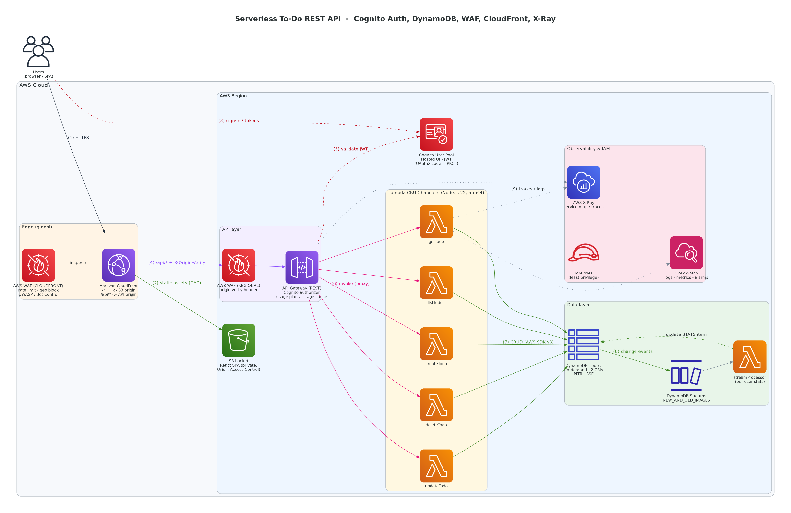

# Serverless To-Do REST API with Cognito Auth, DynamoDB & WAF

A reference architecture for a secure, globally delivered, fully serverless REST API on AWS. The example workload is a multi-user **to-do application**: each user signs in with Amazon Cognito and manages their own tasks through a REST API built on Amazon API Gateway, AWS Lambda and Amazon DynamoDB. AWS WAF protects the edge, Amazon CloudFront delivers both the React frontend and the API from edge locations, and AWS X-Ray traces every request end to end.

> **Scope:** this repository documents the solution design (architecture, data model, API contract, security, observability, deployment approach and cost). Infrastructure is intended to be deployed with **AWS SAM**; illustrative template snippets are included below.

---

## Table of contents

- [Solution overview](#solution-overview)
- [Architecture diagram](#architecture-diagram)
- [Request flow](#request-flow)
- [AWS services used](#aws-services-used)
- [DynamoDB table design](#dynamodb-table-design)
- [API reference](#api-reference)
- [Authentication and authorization](#authentication-and-authorization)
- [Edge security with AWS WAF](#edge-security-with-aws-waf)
- [Caching strategy](#caching-strategy)
- [Observability](#observability)
- [Deployment with AWS SAM](#deployment-with-aws-sam)
- [Cost estimate](#cost-estimate)
- [Design decisions and trade-offs](#design-decisions-and-trade-offs)
- [Clean up](#clean-up)
- [Repository structure](#repository-structure)
- [License](#license)

---

## Solution overview

| Goal | How it is achieved |
|---|---|
| No servers to manage | API Gateway, Lambda, DynamoDB (on-demand), S3, CloudFront, Cognito are all fully managed and scale automatically |
| Secure by default | Cognito JWT authorizer on every API method, WAF on the edge and in-region, private S3 bucket with Origin Access Control, least-privilege IAM per function, encryption at rest and in transit |
| Fast worldwide | CloudFront edge locations serve the SPA and terminate TLS close to users; API Gateway response caching reduces backend load |
| Observable | X-Ray distributed tracing across API Gateway → Lambda → DynamoDB, structured JSON logs, CloudWatch metrics and alarms |
| Pay per use | On-demand DynamoDB, per-request Lambda and API Gateway pricing; near-zero cost when idle (except WAF and API cache) |

---

## Architecture diagram



The diagram is generated as code with the open-source [`diagrams`](https://diagrams.mingrammer.com) library, so it can be version-controlled and regenerated:

```bash
pip install diagrams          # also requires Graphviz (e.g. `brew install graphviz` / `apt install graphviz`)
cd architecture && python diagram.py
```

---

## Request flow

The numbers match the labels on the diagram.

1. **User → CloudFront (HTTPS).** The browser connects to the CloudFront distribution. The global **AWS WAF web ACL** (scope `CLOUDFRONT`) inspects every request before it is served: IP rate limiting, geo blocking, AWS managed OWASP-style rules and Bot Control.
2. **Static frontend.** The default behavior (`/*`) serves the React single-page app from a **private S3 bucket** through **Origin Access Control (OAC)**. The bucket blocks all public access; only this distribution can read it.
3. **Sign-in.** The SPA redirects to the **Cognito Hosted UI** (managed login) using the OAuth 2.0 authorization code flow with PKCE. Cognito returns an ID token, an **access token** and a refresh token (JWTs).
4. **API call.** The SPA calls `https://<distribution>/api/...` with `Authorization: Bearer <access token>`. The `/api/*` behavior forwards the request to the **Regional** API Gateway endpoint (origin path `/prod`; API resources are defined under `/api`, so `/api/todos` maps 1:1 with no rewriting) and adds a secret `X-Origin-Verify` header. A **Regional WAF web ACL** on the API stage blocks any request without this header, so the API cannot be called directly, bypassing CloudFront.
5. **Authorization.** The API Gateway **Cognito User Pool authorizer** validates the JWT signature, expiry, issuer and required OAuth scopes (`todo/read`, `todo/write`). Invalid tokens get `401` without invoking Lambda. For `GET` methods, a valid **stage cache** hit is returned here without touching the backend.
6. **Lambda invocation.** API Gateway invokes the matching CRUD function through Lambda proxy integration. The function reads the caller identity (`sub` claim) from `requestContext.authorizer.claims`, never from the request body.
7. **DynamoDB access.** The function reads or writes the `Todos` table with the AWS SDK for JavaScript v3. All item keys are scoped to the caller's `sub`, so users can only reach their own data.
8. **Change processing.** **DynamoDB Streams** (`NEW_AND_OLD_IMAGES`) feed the `streamProcessor` Lambda, which keeps a per-user `STATS` item up to date (open/done counts). An event source filter only passes `TODO#` items to prevent the function from re-triggering on its own writes.
9. **Tracing and logging.** API Gateway and all Lambda functions have **X-Ray active tracing**; the AWS SDK calls to DynamoDB are captured as subsegments, producing a single trace and service map across API GW → Lambda → DynamoDB. Logs, metrics and alarms go to **Amazon CloudWatch**.

---

## AWS services used

| Service | Role in this solution | Key configuration |
|---|---|---|
| **Amazon API Gateway (REST)** | Public API surface | Regional endpoint, Cognito authorizer with OAuth scopes, request validation (JSON schema models), usage plans + API keys for partner clients, stage-level throttling, 0.5 GB stage cache, X-Ray tracing, access logs in JSON |
| **Amazon Cognito** | User identity | User Pool with email sign-up/verification, Hosted UI / managed login, app client without secret (SPA) using code + PKCE, resource server `todo` with `read`/`write` scopes, optional TOTP MFA, strong password policy |
| **AWS Lambda** | Business logic | One function per operation (`createTodo`, `listTodos`, `getTodo`, `updateTodo`, `deleteTodo`) + `streamProcessor`; Node.js 22.x on arm64 (Graviton); env vars `TABLE_NAME`, `POWERTOOLS_SERVICE_NAME`, `LOG_LEVEL`; Powertools for AWS Lambda (Logger, Tracer, Metrics); one IAM role per function |
| **Amazon DynamoDB** | Data store | Single table `Todos`, on-demand capacity, 2 GSIs, Streams enabled, point-in-time recovery, encryption at rest (AWS owned or customer managed KMS key), deletion protection |
| **AWS WAF** | Edge and origin protection | `CLOUDFRONT` web ACL (in `us-east-1`): rate-based rule, geo match, AWS Managed Rules; `REGIONAL` web ACL on the API stage: origin-verify header rule |
| **Amazon CloudFront** | Global delivery | Two origins (S3 via OAC, API Gateway), HTTPS only, TLS 1.2+, HTTP/2 and HTTP/3, security headers response policy, same-origin API so no CORS is required |
| **Amazon S3** | Frontend hosting | Private bucket, Block Public Access, bucket policy trusting only the distribution (OAC), versioning |
| **AWS X-Ray** | Distributed tracing | Active tracing on API stage and all functions, sampling rules, service map and trace analytics |
| **Amazon CloudWatch** | Logs, metrics, alarms | Structured JSON logs, custom metrics via Embedded Metric Format, alarms on 5XX, latency, Lambda errors/throttles, DynamoDB throttles, WAF blocked requests |
| **AWS IAM** | Permissions | Least-privilege execution role per function (e.g. `getTodo` can only `dynamodb:GetItem` on the table) |

---

## DynamoDB table design

Single-table design keyed by user so every query is naturally tenant-isolated.

**Table `Todos`** — partition key `PK` (string), sort key `SK` (string)

| Entity | PK | SK | Other attributes |
|---|---|---|---|
| Todo | `USER#<sub>` | `TODO#<ulid>` | `todoId`, `title`, `description`, `status` (`OPEN` \| `IN_PROGRESS` \| `DONE`), `priority` (`LOW` \| `MEDIUM` \| `HIGH`), `dueDate` (ISO 8601), `tags`, `createdAt`, `updatedAt`, `version`, GSI keys |
| User stats | `USER#<sub>` | `STATS` | `total`, `open`, `inProgress`, `done` (maintained by `streamProcessor`) |

ULIDs are time-sortable, so querying `PK = USER#<sub> AND begins_with(SK, "TODO#")` returns a user's tasks in creation order.

**Global secondary indexes**

| Index | Partition key | Sort key | Access pattern |
|---|---|---|---|
| `GSI1-Status` | `GSI1PK = USER#<sub>#STATUS#<status>` | `GSI1SK = <dueDate>#<ulid>` | List a user's tasks filtered by status, ordered by due date |
| `GSI2-DueDate` | `GSI2PK = USER#<sub>` | `GSI2SK = <dueDate>#<ulid>` | List a user's upcoming / overdue tasks across all statuses |

**Access patterns**

| # | Access pattern | Operation |
|---|---|---|
| 1 | Create a task | `PutItem` with `attribute_not_exists(PK)` |
| 2 | Get one task | `GetItem` (PK, SK) |
| 3 | List all my tasks (paged) | `Query` on table, `begins_with(SK, "TODO#")` |
| 4 | List my tasks by status | `Query` on `GSI1-Status` |
| 5 | List my tasks due before a date | `Query` on `GSI2-DueDate`, `GSI2SK < :date` |
| 6 | Update a task | `UpdateItem` with optimistic locking (`version = :expected`) |
| 7 | Delete a task | `DeleteItem` with `attribute_exists(PK)` |
| 8 | Get my stats | `GetItem` (`USER#<sub>`, `STATS`) |

---

## API reference

Base URL: `https://<cloudfront-domain>/api` (stage `prod`). All endpoints except `/health` require `Authorization: Bearer <Cognito access token>`.

| Method | Path | Scope | Lambda | Description | Success |
|---|---|---|---|---|---|
| `GET` | `/health` | – | – (mock integration) | Liveness check | `200` |
| `GET` | `/todos` | `todo/read` | `listTodos` | List tasks. Query: `status`, `dueBefore`, `limit` (≤ 100), `nextToken` | `200` |
| `POST` | `/todos` | `todo/write` | `createTodo` | Create a task | `201` |
| `GET` | `/todos/{todoId}` | `todo/read` | `getTodo` | Get a task | `200` |
| `PUT` | `/todos/{todoId}` | `todo/write` | `updateTodo` | Update a task (send `version` for optimistic locking) | `200` |
| `DELETE` | `/todos/{todoId}` | `todo/write` | `deleteTodo` | Delete a task | `204` |
| `GET` | `/me/stats` | `todo/read` | `getTodo` | Task counts by status | `200` |

**Example: create a task**

```http
POST /api/todos
Authorization: Bearer eyJraWQiOi...
Content-Type: application/json

{
  "title": "Prepare architecture review",
  "description": "Walk through WAF and caching choices",
  "priority": "HIGH",
  "dueDate": "2026-10-05",
  "tags": ["work"]
}
```

```json
HTTP/1.1 201 Created
{
  "todoId": "01J8ZQ6T3M4V9K2R7B5N0XWQ1H",
  "title": "Prepare architecture review",
  "status": "OPEN",
  "priority": "HIGH",
  "dueDate": "2026-10-05",
  "tags": ["work"],
  "version": 1,
  "createdAt": "2026-09-26T10:15:30Z",
  "updatedAt": "2026-09-26T10:15:30Z"
}
```

**Error model**

| Status | When |
|---|---|
| `400` | Request body fails the API Gateway JSON schema model or business validation |
| `401` | Missing, expired or invalid JWT |
| `403` | Token lacks required scope, or request blocked by WAF |
| `404` | Task does not exist for this user |
| `409` | Optimistic-lock conflict (`version` mismatch) |
| `429` | API Gateway throttling / usage plan quota, or WAF rate limit |
| `5XX` | Unhandled error (alarmed in CloudWatch) |

Errors use a consistent body: `{ "error": { "code": "NOT_FOUND", "message": "Todo not found", "requestId": "..." } }`.

---

## Authentication and authorization

- **User Pool:** email as username, email verification, password policy (min 12 chars, mixed case, numbers, symbols), optional TOTP MFA, account recovery by verified email.
- **App client:** public client (no secret) for the SPA; OAuth 2.0 authorization code grant with PKCE; allowed scopes `openid`, `email`, `todo/read`, `todo/write`; callback and sign-out URLs point to the CloudFront domain.
- **Tokens:** access token 60 min, ID token 60 min, refresh token 30 days; refresh token rotation enabled. Tokens are kept in memory by the SPA, not in `localStorage`.
- **API authorizer:** `COGNITO_USER_POOLS` authorizer on every method with `AuthorizationScopes`, so API Gateway accepts **access tokens** and enforces scopes before Lambda runs.
- **Tenant isolation:** Lambda derives the partition key from the verified `sub` claim. Clients never pass a user ID.
- **Usage plans:** `Basic` and `Partner` usage plans with API keys define per-client throttle (requests/sec, burst) and monthly quotas for machine-to-machine clients. API keys are used for metering and throttling only, never as an authentication mechanism.

---

## Edge security with AWS WAF

**Web ACL 1 — scope `CLOUDFRONT`** (must be created in `us-east-1`, associated with the distribution)

| Priority | Rule | Action |
|---|---|---|
| 0 | `GeoBlock` – geo match on a configurable list of countries | Block |
| 1 | `RateLimitPerIP` – rate-based rule, 500 requests per 5 minutes per IP, scoped to `/api/*` | Block (returns `429` via custom response) |
| 2 | `AWSManagedRulesAmazonIpReputationList` | Block |
| 3 | `AWSManagedRulesCommonRuleSet` (OWASP Top 10 style protections: XSS, LFI, bad bots, size limits) | Block |
| 4 | `AWSManagedRulesKnownBadInputsRuleSet` (Log4j, exploitable paths) | Block |
| 5 | `AWSManagedRulesBotControlRuleSet` (Common inspection level) | Block / Challenge verified-bad bots |
| – | Default action | Allow |

**Web ACL 2 — scope `REGIONAL`** (associated with the API Gateway stage)

| Priority | Rule | Action |
|---|---|---|
| 0 | `RequireOriginVerifyHeader` – `X-Origin-Verify` must equal the secret configured on the CloudFront origin (stored in Secrets Manager and rotated) | Block if missing |

WAF logs are sent to CloudWatch Logs (`aws-waf-logs-*` log group) with sensitive headers (`Authorization`) redacted.

---

## Caching strategy

| Layer | What is cached | Settings |
|---|---|---|
| CloudFront `/*` | SPA assets (JS/CSS with content hashes) | `CachingOptimized` policy, long TTL; `index.html` served with `Cache-Control: no-cache`; invalidate `/index.html` on deploy |
| CloudFront `/api/*` | Nothing by default | `CachingDisabled` cache policy + `AllViewerExceptHostHeader` origin request policy so the edge forwards auth headers and query strings unchanged |
| API Gateway stage cache | `GET /todos`, `GET /todos/{todoId}`, `GET /me/stats` | 0.5 GB cache, TTL 30 s; cache key = path + query string + `Authorization` header so users never see each other's data; caching disabled on `POST`/`PUT`/`DELETE`; cache encrypted |

Trade-off: a user can see data up to 30 seconds stale after a write. The SPA applies optimistic UI updates after writes to hide this. Reduce the TTL (or disable caching on `GET /todos`) if strict read-after-write consistency matters more than backend offload.

---

## Observability

- **X-Ray:** `TracingEnabled: true` on the API stage and `Tracing: Active` on all functions. Powertools Tracer wraps the DynamoDB client so each `GetItem`/`Query`/`PutItem` shows as a subsegment with latency and errors. The service map shows `Client → API Gateway → Lambda → DynamoDB`.
- **Logs:** API Gateway JSON access logs (request ID, user `sub`, status, latency, WAF result); Lambda structured JSON logs with correlation ID = API Gateway request ID; 30-day retention.
- **Metrics:** Lambda (errors, duration, throttles, concurrent executions), API Gateway (`4XXError`, `5XXError`, `Latency`, `CacheHitCount`, `CacheMissCount`), DynamoDB (`ThrottledRequests`, `SuccessfulRequestLatency`), WAF (`BlockedRequests`), custom business metrics (`TodosCreated`, `TodosCompleted`).
- **Alarms (to an SNS topic):** API 5XX rate > 1% for 5 min, p99 latency > 1 s, any Lambda errors or throttles, DynamoDB throttles, `streamProcessor` iterator age > 60 s, spike in WAF blocked requests.
- **Stream resilience:** `streamProcessor` uses `BisectBatchOnFunctionError`, `MaximumRetryAttempts: 3` and an SQS on-failure destination so a bad record cannot block the shard.

---

## Deployment with AWS SAM

### Prerequisites

- AWS account and AWS CLI v2 configured
- AWS SAM CLI
- Node.js 22.x
- The CloudFront-scoped WAF web ACL must live in `us-east-1` (deploy the stack there, or deploy the edge WAF as a separate `us-east-1` stack and pass its ARN as a parameter)

### Suggested stack layout

| Stack | Resources |
|---|---|
| `todo-edge` (us-east-1) | WAF web ACL (`CLOUDFRONT`), optional ACM certificate for a custom domain |
| `todo-backend` | Cognito User Pool + domain + app client + resource server, DynamoDB table, Lambda functions, API Gateway REST API (authorizer, models, usage plans, cache), Regional WAF + association, CloudWatch alarms |
| `todo-frontend` | S3 bucket, OAC, CloudFront distribution (two origins, behaviors, response headers policy) |

### Illustrative SAM excerpt

```yaml
Globals:
  Function:
    Runtime: nodejs22.x
    Architectures: [arm64]
    Tracing: Active
    MemorySize: 256
    Timeout: 10
    Environment:
      Variables:
        TABLE_NAME: !Ref TodosTable
        POWERTOOLS_SERVICE_NAME: todo-api

Resources:
  TodoApi:
    Type: AWS::Serverless::Api
    Properties:
      StageName: prod
      EndpointConfiguration: { Type: REGIONAL }
      TracingEnabled: true
      CacheClusterEnabled: true
      CacheClusterSize: "0.5"
      Auth:
        DefaultAuthorizer: CognitoAuth
        Authorizers:
          CognitoAuth:
            UserPoolArn: !GetAtt UserPool.Arn
      MethodSettings:
        - ResourcePath: "/*"
          HttpMethod: "*"
          ThrottlingRateLimit: 100
          ThrottlingBurstLimit: 200
        - ResourcePath: "/~1api~1todos"   # "/" is encoded as "~1"
          HttpMethod: GET
          CachingEnabled: true
          CacheTtlInSeconds: 30

  ListTodosFunction:
    Type: AWS::Serverless::Function
    Properties:
      Handler: listTodos.handler
      Policies:
        - DynamoDBReadPolicy: { TableName: !Ref TodosTable }
      Events:
        List:
          Type: Api
          Properties:
            RestApiId: !Ref TodoApi
            Path: /api/todos
            Method: GET
            Auth:
              AuthorizationScopes: [todo/read]

  TodosTable:
    Type: AWS::DynamoDB::Table
    Properties:
      BillingMode: PAY_PER_REQUEST
      DeletionProtectionEnabled: true
      PointInTimeRecoverySpecification: { PointInTimeRecoveryEnabled: true }
      StreamSpecification: { StreamViewType: NEW_AND_OLD_IMAGES }
      AttributeDefinitions:
        - { AttributeName: PK, AttributeType: S }
        - { AttributeName: SK, AttributeType: S }
        - { AttributeName: GSI1PK, AttributeType: S }
        - { AttributeName: GSI1SK, AttributeType: S }
        - { AttributeName: GSI2PK, AttributeType: S }
        - { AttributeName: GSI2SK, AttributeType: S }
      KeySchema:
        - { AttributeName: PK, KeyType: HASH }
        - { AttributeName: SK, KeyType: RANGE }
      GlobalSecondaryIndexes:
        - IndexName: GSI1-Status
          KeySchema:
            - { AttributeName: GSI1PK, KeyType: HASH }
            - { AttributeName: GSI1SK, KeyType: RANGE }
          Projection: { ProjectionType: ALL }
        - IndexName: GSI2-DueDate
          KeySchema:
            - { AttributeName: GSI2PK, KeyType: HASH }
            - { AttributeName: GSI2SK, KeyType: RANGE }
          Projection: { ProjectionType: ALL }
```

### Deploy steps

```bash
# 1. Edge WAF (us-east-1)
sam deploy --template-file edge.yaml --stack-name todo-edge --region us-east-1

# 2. Backend (API, Lambda, DynamoDB, Cognito, regional WAF)
sam build && sam deploy --guided --stack-name todo-backend

# 3. Frontend infrastructure (S3 + CloudFront), then publish the SPA
sam deploy --template-file frontend.yaml --stack-name todo-frontend \
  --parameter-overrides EdgeWebAclArn=<arn> ApiDomain=<api-id>.execute-api.<region>.amazonaws.com
npm run build --prefix frontend
aws s3 sync frontend/dist s3://<bucket> --delete
aws cloudfront create-invalidation --distribution-id <id> --paths "/index.html"
```

---

## Cost estimate

Rough monthly estimate in `us-east-1` for **10,000 active users and ~5 million API requests/month**. Prices change; confirm with the [AWS Pricing Calculator](https://calculator.aws/).

| Service | Driver | Approx. monthly |
|---|---|---|
| API Gateway (REST) | 5M requests | ~$17.50 |
| API Gateway cache | 0.5 GB, always on | ~$14.60 |
| Lambda | 5M invocations, 256 MB arm64, ~50 ms avg | ~$2 |
| DynamoDB on-demand | ~2M writes, ~8M reads, < 1 GB storage | ~$3 |
| Cognito | 10,000 MAU | Free tier (Lite/Essentials) |
| AWS WAF | 2 web ACLs, ~7 rules, 5M requests, Bot Control | ~$35 |
| CloudFront + S3 | < 100 GB transfer | Largely within free tier |
| X-Ray | 5% sampling | ~$1 |
| CloudWatch | Logs, metrics, alarms | ~$5 |
| **Total** | | **~$75–80 / month** |

The fixed costs (WAF web ACLs and rules, API cache) dominate at low traffic. For development environments, disable the stage cache and Bot Control to bring idle cost close to $10/month.

---

## Design decisions and trade-offs

| Decision | Why | Alternative |
|---|---|---|
| REST API (not HTTP API) | Needed for stage caching, usage plans/API keys, request validation and native WAF association | HTTP API is cheaper and faster but lacks these features |
| Regional API endpoint behind our own CloudFront | Full control of cache/origin policies and one WAF at the edge; an edge-optimized endpoint would add a second, unmanaged CloudFront hop | Edge-optimized endpoint without a custom distribution |
| Single CloudFront distribution for SPA + API | Same origin → no CORS preflights, one TLS certificate, one WAF | Separate distributions / subdomains |
| One Lambda per operation | Least-privilege IAM per operation, independent scaling and metrics | A single "monolith" Lambda with a router (fewer cold starts, simpler deploys) |
| Single-table DynamoDB with user-scoped keys | Tenant isolation by design, all queries are key lookups, no scans | Separate tables per entity |
| On-demand capacity | Unpredictable, spiky traffic; zero capacity planning | Provisioned + auto scaling when traffic becomes steady |
| Access tokens with OAuth scopes | Least-privilege API access; scopes enforced by API Gateway before Lambda runs | ID tokens (no scope enforcement) |

---

## Clean up

To avoid ongoing charges, delete the stacks in reverse order:

```bash
aws s3 rm s3://<bucket> --recursive
sam delete --stack-name todo-frontend
# DynamoDB deletion protection must be disabled first
aws dynamodb update-table --table-name <table> --no-deletion-protection-enabled
sam delete --stack-name todo-backend
sam delete --stack-name todo-edge --region us-east-1
```

---

## Repository structure

```
.
├── README.md                          # This documentation
├── LICENSE
└── architecture/
    ├── architecture-diagram.png       # Solution architecture diagram
    └── diagram.py                     # Diagram-as-code source (mingrammer/diagrams)
```

---

## License

This project is licensed under the MIT License. See [LICENSE](LICENSE).

**Author:** [@omarmahmoud00](https://github.com/omarmahmoud00)
